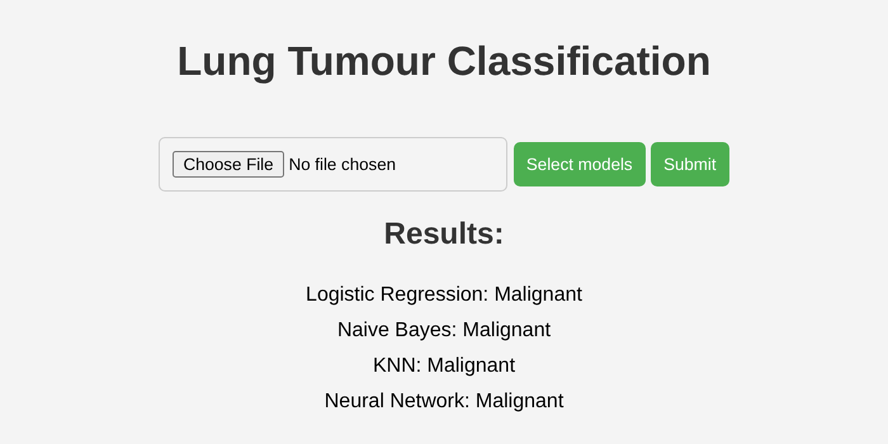

# Lung Cancer Classifier (CT images)

Classification of lung CT slices into **benign**, **malignant** or **normal**. The classifiers (logistic regression, KNN, Naive Bayes and an MLP) are implemented by hand with NumPy. A ResNet50 pretrained on ImageNet is used only as a feature extractor, and a small Flask app classifies an uploaded image.

Started as the course project for DACO at FEUP (Faculty of Engineering, University of Porto), between December 2023 and January 2024, and improved afterwards (patient-level evaluation and better features).



## Problem

Given one CT slice from the IQ-OTH/NCCD lung cancer dataset, predict whether it comes from a benign case, a malignant case or a normal (healthy) case. After removing exact duplicates there are 1054 slices: 102 benign, 547 malignant and 405 normal. They come from only 110 patients (15 benign, 40 malignant, 55 normal).

## The main issue: data leakage between patients

Each patient contributes many consecutive slices that look almost the same. If the images are split at random, slices of the same patient end up in train and test, and the model only has to recognise the patient. The first version of this project (and many published results on this dataset) used a random split.

The dataset has no patient ID, so the patients are reconstructed approximately (`src/preproc.py`): the file numbers follow the slice order, so each class is cut at the biggest jumps between consecutive images (one cut less than the number of patients), and groups that share near-identical images are merged. This gives 103 groups, and all the evaluation is done so that a group is never in train and test at the same time.

Same model and features, only the split changes (`src/leakage_check.py`, 5-fold CV on all the data):

| Split | Accuracy | Macro F1 | Benign recall |
|---|---|---|---|
| Random (by image) | 0.954 | 0.904 | 0.74 |
| By patient | 0.873 | 0.729 | 0.37 |

## Approach

**Preprocessing** (`src/preproc.py`)
- Exact duplicate images (43) are removed.
- Images are centre cropped to a square. 60 of the 61 images that are not 512x512 are malignant, so stretching them would let a model learn the image shape instead of the content.
- The lungs are segmented with a simple intensity threshold and their bounding box is cropped, so the region where the nodules are gets more resolution.

**Features** (`src/features.py`, `src/extract_features.py`)
- ResNet50 pretrained on ImageNet, without its last layer, applied to the whole slice and to the lung crop: 2048 + 2048 = 4096 features per image. The network is not trained here.

**Classifiers** (implemented from scratch, scikit-learn is only used for the splits, scaling, PCA and metrics)
- Softmax logistic regression with L2 regularisation and class weights (`src/logistic_regression_manual.py`)
- KNN, k = 3, on 50 PCA components (`src/knn_manual.py`)
- Gaussian Naive Bayes on 20 PCA components (`src/naive_bayes_manual.py`)
- MLP with two hidden layers (128 and 64, sigmoid) trained with mini-batch backpropagation (`src/ann_manual.py`)

**Evaluation** (`src/evaluation.py`)
- About 20% of the patients (20 groups, 209 images) are kept aside as the final test set and used only once.
- Choices like the features and the hyperparameters were made with 5-fold cross-validation by patient on the remaining 80% (845 images).
- Macro F1 is reported together with accuracy, since the classes are imbalanced and accuracy alone hides the benign class.

## Results

The full outputs are in [`results/`](results/) (logs, metrics in JSON and confusion matrices).

**Cross-validation by patient on the development set** (mean ± std over 5 folds):

| Model | Accuracy | Macro F1 | Benign recall |
|---|---|---|---|
| Logistic regression | 0.867 ± 0.047 | 0.712 ± 0.071 | 0.28 |
| KNN | 0.758 ± 0.040 | 0.617 ± 0.026 | 0.27 |
| Naive Bayes | 0.667 ± 0.082 | 0.542 ± 0.046 | 0.23 |
| MLP | 0.860 ± 0.056 | 0.672 ± 0.079 | 0.16 |

**Held-out test set** (patients never used before):

| Model | Accuracy | Macro F1 | Benign recall | Malignant recall |
|---|---|---|---|---|
| Logistic regression | 0.861 | 0.695 | 0.28 | 0.98 |
| KNN | 0.761 | 0.622 | 0.33 | 0.90 |
| Naive Bayes | 0.751 | 0.673 | 0.61 | 0.74 |
| MLP | 0.890 | 0.692 | 0.17 | 1.00 |

The test results are close to the cross-validation ones, so the estimate looks stable. The logistic regression has the best macro F1 in both. The MLP has a similar accuracy but misses more benign slices, and Naive Bayes finds more benign slices on the test set but loses many malignant ones. Note that the test set has only 3 benign patients (18 images), so the benign recall there is very noisy.

**Compared with the first version** (raw pixels as features, same patient-level evaluation, [`results/baseline_raw_pixels/`](results/baseline_raw_pixels/)), the accuracy was between 0.62 and 0.66 and the macro F1 between 0.47 and 0.50 for the four models.

### What works and what doesn't

- **Malignant vs the rest works well**: the logistic regression finds almost every malignant slice (recall 0.96 in CV, 0.98 on the test set).
- **Benign vs normal is the weak point.** The label belongs to the patient, not to the slice. A benign patient has many slices where the nodule is not visible, and those slices are, in practice, normal images with a benign label. With only 15 benign patients there is little signal to learn from. Texture features (LBP, GLCM), looking for the most suspicious tile of the lungs and stronger class weights were tried, and none of them separated benign from normal in a reliable way.
- The patient groups are an approximation, so some leakage may still be there.

### Future work

- Use a dataset with the nodules annotated, such as LIDC-IDRI, to train a "does this slice have a nodule?" detector and use it as an extra feature.
- Classify the whole patient (all the slices together) instead of single slices, which is what the labels actually describe.

## How to run

1. Install the dependencies (Python 3.10 or newer):

   ```bash
   pip install -r requirements.txt
   ```

2. Download the dataset from [Kaggle](https://www.kaggle.com/datasets/hamdallak/the-iqothnccd-lung-cancer-dataset) or [Mendeley Data](https://data.mendeley.com/datasets/bhmdr45bh2/1) and put the three class folders inside `data/`:

   ```
   data/
   ├── Bengin cases/
   ├── Malignant cases/
   └── Normal cases/
   ```

   The folder names just need to sort in the order benign, malignant, normal (the original names already do). Keep the original file names, the patient groups use their numbers.

3. Extract the features (downloads the ResNet50 weights the first time, a few minutes on CPU):

   ```bash
   python src/extract_features.py
   ```

4. Train and evaluate the models (each one saves its outputs to `results/` and the final model to `models/`):

   ```bash
   python src/logistic_regression_manual.py
   python src/knn_manual.py
   python src/naive_bayes_manual.py
   python src/ann_manual.py
   python src/leakage_check.py
   ```

5. Run the app and open http://127.0.0.1:5000:

   ```bash
   python src/main.py
   ```

## Project structure

```
data/       dataset goes here (not included)
docs/       screenshot
features/   extracted features (created by the scripts, not included)
models/     trained models (created by the scripts, not included)
results/    logs, metrics and confusion matrices
src/        preprocessing, features, models and Flask app
```

## Dataset

Hamdalla Alyasriy, *The IQ-OTH/NCCD lung cancer dataset*, Mendeley Data, V1, doi: [10.17632/bhmdr45bh2.1](https://doi.org/10.17632/bhmdr45bh2.1). The images belong to their authors and are not redistributed here.
